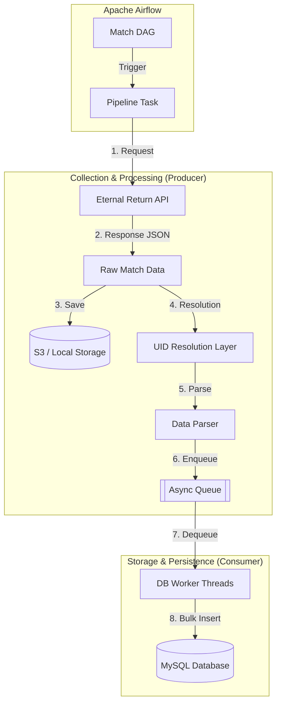
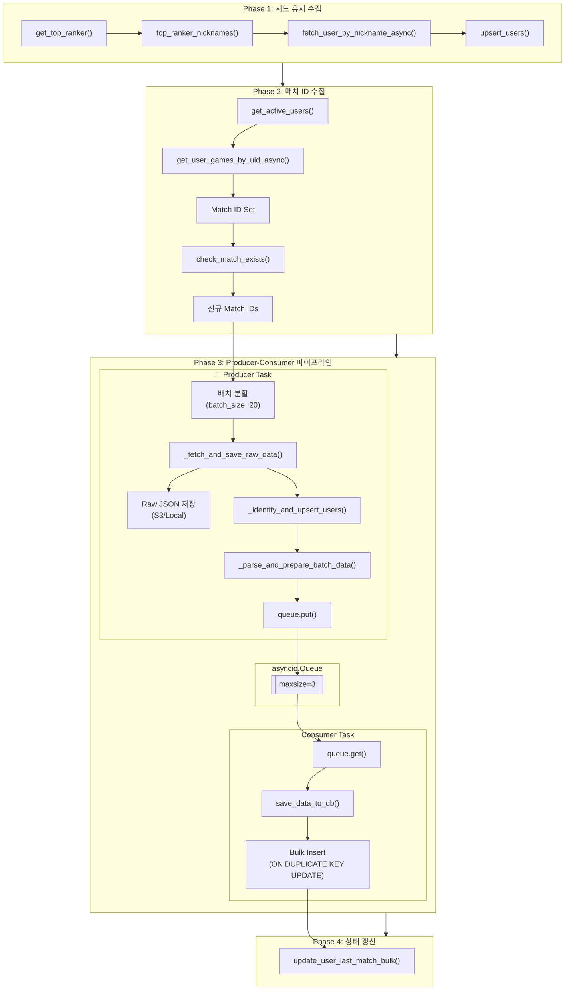

# Eternal Return Data Pipeline (ER-Pipeline)

> **High-Performance Asynchronous ETL System for Eternal Return API**  
> 대규모 게임 데이터를 수집, 정제, 적재하기 위한 엔터프라이즈급 데이터 파이프라인

**ER-Pipeline**은 님블뉴런의 '이터널 리턴(Eternal Return)' 공식 Open API를 활용하여 매치 데이터를 수집하고 분석 가능한 형태로 가공하는 고성능 데이터 파이프라인입니다. 비동기 I/O(Asyncio)와 Producer-Consumer 패턴을 통해 처리량을 극대화하였으며, Apache Airflow를 도입하여 데이터의 수집부터 검증까지 전 과정을 자동화하였습니다.

본 프로젝트는 로컬 개발 환경부터 AWS 클라우드 운영 환경까지 유연하게 대응할 수 있는 **하이브리드 아키텍처**를 채택하고 있습니다.

---

## 아키텍처 및 핵심 기술 (Architecture & Key Features)

### 0. 시스템 아키텍처 다이어그램 (System Architecture Diagram)



**데이터 흐름 설명 (Data Flow):**

1.  **Orchestration**: Airflow DAG가 설정된 주기(5분/Daily)에 맞춰 파이프라인 태스크를 트리거합니다.
2.  **Collection (Producer)**:
    *   API로부터 비동기(Async)로 매치 데이터를 수집합니다.
    *   수집된 원본(Raw JSON)은 데이터 레이크(S3/Local)에 즉시 저장하여 유실을 방지합니다.
    *   **Resolution Layer**에서 닉네임 기반으로 UID를 검증하고 내부 식별자를 주입합니다.
    *   파서(Parser)가 데이터를 정규화하여 메모리 효율적인 구조(`List[Dict]`)로 변환 후 큐(Queue)에 적재합니다.
3.  **Persistence (Consumer)**:
    *   컨슈머 워커가 큐에서 데이터를 가져와 SQLAlchemy Bulk Insert를 통해 DB에 고속으로 적재합니다.

### 상세 데이터 흐름도 (Detailed Data Flow)

다음 다이어그램은 매치 데이터 수집 파이프라인의 상세한 흐름을 보여줍니다.



### 모듈별 역할 (Module Responsibilities)

| 모듈 | 역할 | 주요 함수 |
|------|------|----------|
| `main.py` | CLI 진입점, 프로세스 분기 | `run_full_process()`, `run_hash_process()` |
| `pipeline.py` | Producer-Consumer 오케스트레이션 | `run_pipeline()`, `produce_batches()`, `consume_batches()` |
| `crawler.py` | 비동기 API 클라이언트 | `ERAPIClient`, `_fetch_json()`, `get_match_infos_async()` |
| `db_utils.py` | DB CRUD 및 캐싱 | `save_data_to_db()`, `upsert_users()`, `check_match_exists()` |
| `match_info_parsing.py` | 매치 데이터 파싱 (Wide/Long Format) | `parse_match_data()`, `_parse_*_from_game()` |
| `hash_info_parsing.py` | 메타데이터 파싱 | `parse_all_meta_files()`, `parse_character_info()` |
| `storage.py` | 저장소 추상화 (Strategy 패턴) | `LocalStorage`, `S3Storage`, `get_storage()` |
| `models.py` | SQLAlchemy ORM 모델 | 30개 테이블 정의 |

---

### 1. 고성능 비동기 수집 (High-Throughput Collection)
- **Non-blocking I/O**: `asyncio`와 `aiohttp`를 활용하여 네트워크 대기 시간을 최소화하고 동시성(Concurrency)을 극대화했습니다.
- **Producer-Consumer 패턴**: 데이터 수집(CPU/Network Bound)과 DB 적재(I/O Bound) 로직을 `asyncio.Queue`로 분리하여 병목 현상을 해소하고 시스템 리소스를 효율적으로 사용합니다.
- **메모리 최적화**: 무거운 Pandas DataFrame 의존성을 제거하고, Python Native `List[Dict]`와 SQLAlchemy Bulk Insert 방식을 적용하여 대용량 데이터 처리 시 메모리 사용량을 획기적으로 절감했습니다.

### 2. 데이터 무결성 보장 (Data Integrity)
- **Resolution Layer**: API 정책 변경(`userNum` 폐지)에 대응하여, 닉네임 기반으로 UID를 선행 조회하고 내부 식별자(`user_num`)로 매핑하는 검증 계층을 구현했습니다.
- **Schema-First Initialization**: SQLAlchemy 모델(`models.py`)을 Single Source of Truth로 정의하여, 컨테이너 구동 시 DB 스키마가 모델과 완벽하게 일치하도록 자동 초기화합니다.
- **Continuous Batch Processing**: 대규모 데이터 유입 시 타임아웃을 방지하기 위해 배치 크기를 제한하고, 연속적인 스케줄링으로 데이터를 끊임없이 처리합니다.

### 3. 하이브리드 인프라 (Hybrid Infrastructure)
- **Environment Agnostic**: 환경 변수(`ENV`) 설정만으로 로컬 저장소(File System/Docker MySQL)와 클라우드 저장소(AWS S3/RDS) 간의 전환이 즉시 가능합니다.
- **Airflow Orchestration**: 데이터 특성에 따라 파이프라인을 이원화하여 관리합니다.
    - **`match_dag`**: 실시간 매치 데이터 수집 (5분 주기, Continuous)
    - **`hash_dag`**: 정적 메타데이터(캐릭터, 아이템 등) 갱신 (Daily)

---

## 기술 스택(Tech Stack)

| Category | Technology | Description |
| --- | --- | --- |
| **Language** | Python 3.10+ | Type Hinting, Asyncio |
| **Orchestration** | Apache Airflow 2.x | Workflow Management, Scheduling |
| **Database** | MySQL 8.0 | Main Data Warehouse |
| **ORM** | SQLAlchemy (Async) | Database Abstraction, Schema Management |
| **Migration** | Alembic | Schema Version Control |
| **Container** | Docker & Compose | Infrastructure as Code |
| **Cloud (Ops)** | AWS (EC2, S3, RDS) | Production Environment |
| **CI/CD** | GitHub Actions | Automated Testing & Deployment |

---

## 📂 프로젝트 구조(Project Structure)

```text
eternal_return_crawler/
├── .github/                 # CI/CD Workflows
├── alembic/                 # DB 마이그레이션 스크립트
├── config/                  # API URL 및 설정 파일
├── dags/                    # Airflow DAG 정의
│   ├── match_dag.py         # [Hourly/Continuous] 매치 데이터 수집
│   └── hash_dag.py          # [Daily] 정적 메타데이터 갱신
├── scripts/                 # 비즈니스 로직 (Core)
│   ├── main.py              # CLI 진입점
│   ├── pipeline.py          # Producer-Consumer 오케스트레이션
│   ├── crawler.py           # Async API Client
│   ├── models.py            # SQLAlchemy DB 모델
│   ├── db_utils.py          # DB 세션 및 쿼리 유틸리티
│   ├── storage.py           # 저장소 추상화 (Local/S3)
│   └── match_info_parsing.py# 데이터 파싱 및 정제
├── docker-compose.yml       # Production/Base 인프라 정의
├── docker-compose.local.yml # Local Development 오버라이드
├── Dockerfile               # Python 애플리케이션 이미지
├── pyproject.toml           # 의존성 관리 (Poetry)
└── README.md                # 프로젝트 문서
```

---

## 시작하기 (Getting Started)

### 1. 사전 요구 사항 (Prerequisites)

- **Docker** 및 **Docker Desktop** 설치
- **Git** 설치
- **Eternal Return API Key** 발급 (개발자 포털)

### 2. 환경 설정 (.env)

프로젝트 루트 디렉토리에 `.env` 파일을 생성하고 아래 설정을 입력합니다. AWS를 사용할 경우 해당 인자를 github settings의 Actions secrets and variables에 입력하세요.

```ini
# [필수] API Key
API_KEY="YOUR_API_KEY_HERE"

# [환경 설정] dev: 로컬 / prod: 클라우드
ENV="dev"

# [Airflow 설정]
AIRFLOW_UID=50000

# [데이터베이스 설정 - 로컬/도커 내부 통신용]
DB_HOST="erdb"
DB_PORT=3306
DB_NAME="erdb"
DB_USER="root"
DB_PASSWORD="password"

# [파이프라인 튜닝]
USER_BATCH_LIMIT=30000    # 1회 실행 시 처리할 최대 유저 수
DB_MAX_WORKERS=8          # DB 적재 병렬 워커 수

# [AWS 설정 - ENV=prod 일 경우 필수]
# AWS_ACCESS_KEY_ID=...
# AWS_SECRET_ACCESS_KEY=...
# AWS_S3_BUCKET=...
```

### 3. 실행 방법 (Execution)

#### A. 로컬 개발 환경 (Local Docker)
MySQL 데이터베이스와 Airflow를 로컬 컨테이너로 구동합니다.

```bash
# 컨테이너 빌드 및 실행 (로컬 설정 적용)
docker compose -f docker-compose.yml -f docker-compose.local.yml up -d --build
```
- **초기화**: 컨테이너 실행 시 `scripts/init_db.py`가 자동 실행되어 테이블 생성 및 Alembic 버전 동기화(Stamping)를 수행합니다.
- **접속 정보**:
    - **Airflow Web UI**: [http://localhost:8080](http://localhost:8080) (ID/PW: `airflow` / `airflow`)
    - **MySQL (Host)**: `localhost:3307` (컨테이너 내부 3306 포트 포워딩)

#### B. 클라우드/운영 환경 (Production)
외부 관리형 DB(RDS)와 S3를 사용하며, 로컬 DB 컨테이너는 실행하지 않습니다.

```bash
# 기본 설정만 사용하여 실행
docker compose up -d --build
```
- 반드시 `.env` 파일의 `ENV` 값을 `prod`로 설정하고 AWS 관련 변수를 주입해야 합니다.

#### C. CLI 모드 (테스트용)
Airflow 없이 개별 파이프라인 프로세스를 테스트할 수 있습니다.

```bash
# 의존성 설치
poetry install

# 정적 데이터 수집 실행
poetry run python scripts/main.py hash

# 매치 데이터 수집 실행
poetry run python scripts/main.py match
```

---

## Airflow 사용 가이드

Web UI ([http://localhost:8080](http://localhost:8080))에 접속하여 DAG를 제어합니다.

1. **DAG 활성화 (Unpause)**:
   - `eternal_return_hash_v1`: 정적 메타데이터 수집. (최초 1회 실행 권장)
   - `eternal_return_match_v1`: 매치 데이터 수집.
   - 왼쪽의 **OFF/ON 토글**을 클릭하여 파란색(ON)으로 변경합니다.

2. **실행 (Trigger)**:
   - 우측의 **Actions** 열에서 `▶` 버튼을 눌러 즉시 실행할 수 있습니다.
   - `match_dag`는 설정된 주기(기본 5분)에 따라 자동으로 실행되며, 이전 작업이 끝나지 않았을 경우 대기(Skip)합니다.

---

## 데이터베이스 마이그레이션 (Alembic)

DB 스키마 변경이 필요할 경우, SQL을 직접 수정하지 않고 Alembic을 사용합니다.

```bash
# 1. 모델(models.py) 수정

# 2. 마이그레이션 파일 생성 (컨테이너 내부에서 실행 권장)
docker compose exec airflow-scheduler poetry run alembic revision --autogenerate -m "변경내용_요약"

# 3. 변경 사항 DB 반영
docker compose exec airflow-scheduler poetry run alembic upgrade head
```

> **주의**: `autogenerate`는 완벽하지 않을 수 있으므로, 생성된 리비전 파일을 반드시 검토해야 합니다.

---

## 문서 가이드 (Documentation)

| 문서 | 설명 |
|------|------|
| [데이터 카탈로그](docs/data_statement/data_catalog.md) | 전체 데이터 자산 목록, 용어 사전, 데이터 계보, 품질 규칙, 분석 시나리오 가이드 |
| [데이터 명세서](docs/data_statement/data_specification.md) | ERD + 32개 테이블 전체 컬럼 명세, API 매핑표 |
| [데이터 흐름도](docs/data_statement/data_flow_diagram.md) | 시스템 아키텍처, 파이프라인 흐름, 함수 레퍼런스 |

---

## 트러블슈팅 (Troubleshooting)

**Q. "localhost에서 연결을 거부했습니다" (Connection Refused)**
- 로컬에서 DB 접속 시 포트가 **3307**인지 확인하십시오. (3306은 컨테이너 내부 포트입니다.)
- 컨테이너가 `starting` 상태인지 확인하십시오 (`docker ps`).

**Q. Alembic 실행 시 `Table not found` 또는 빈 파일 생성**
- 복합 키나 특수 제약 조건의 경우 `autogenerate`가 감지하지 못할 수 있습니다. [Engineering Guide] Alembic Manual 문서를 참고하여 수동으로 작성하십시오.

**Q. Airflow Task Timeout**
- 데이터 급증으로 인한 타임아웃일 수 있습니다. `config.py`의 `USER_BATCH_LIMIT`를 조절하거나, `match_dag.py`의 타임아웃 설정을 확인하십시오.

---