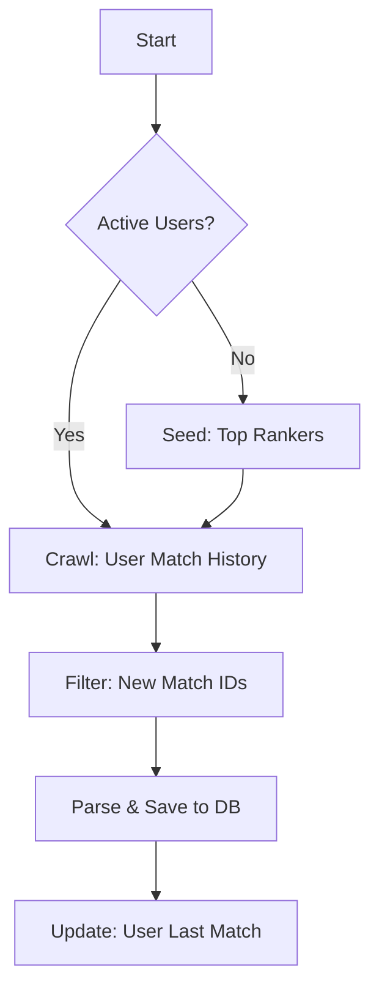

# Eternal Return Crawler & Pipeline
WIP ~ 
**이터널 리턴(Eternal Return)** 공식 Open API를 활용한 데이터 수집 파이프라인

## 주요 기능

-   **데이터 수집**: 이터널 리턴 Open API를 활용하여 매치 데이터 수집
-   **데이터 파싱 및 저장**: 수집된 원시 JSON 데이터를 정제하여 MySQL DB에 적재
-   **오케스트레이션**: Airflow를 이용한 수집 워크플로우 자동화

## 🛠 기술 스택

-   **언어**: `Python 3.10+`
-   **데이터 수집**: `aiohttp`, `requests`
-   **데이터 처리**: `pandas`
-   **데이터베이스**: `MySQL 8.0`, `SQLAlchemy`, `Alembic`
-   **인프라 & 스케줄링**: `Docker`, `Docker Compose`, `Airflow`
-   **의존성 관리**: `Poetry`

## 📂 프로젝트 구조

```
eternal_return_crawler/
├── .gitignore
├── pyproject.toml
├── poetry.lock
├── README.md
├── alembic/               
├── db/                    # DB 관련 파일 (schema.sql)
├── dags/                  # Airflow DAG 파일 (Docker 환경용)
│   ├── er_pipeline.py     # 데이터 수집 파이프라인
│   └── init_system.py     # 시스템 초기화 파이프라인
├── scripts/               
│   ├── main.py            # 로컬 실행
│   ├── config.py          # 설정 파일
│   ├── pipeline.py        # 파이프라인 로직
│   ├── crawler.py         # API 호출
│   ├── models.py          # DB 모델 정의
│   ├── db_utils.py        # DB 유틸리티
│   ├── match_info_parsing.py # 매치 데이터 파싱
│   └── hash_info_parsing.py # 해싱 데이터 파싱
│
├── docs/                  # ERD 및 문서
├── docker-compose.yml     # Docker 실행 설정
└── logs/                   
```

## 데이터베이스 구조
상세 스키마 설계 및 관계도는 `docs/ERD/s9_erd.vuerd.json` 파일을 통해 확인 가능(Vuerd 등 시각화 도구 사용 권장)

---

## 설정

어떤 방식으로 실행하든 아래 설정은 공통적으로 진행

1.  **Poetry 설치 (로컬 실행 시)**
    ```bash
    pip install poetry
    poetry install
    ```

2.  **환경 변수(`.env`) 설정**
    프로젝트 경로에 `.env` 파일을 생성하고 내용을 작성

    ```env
    API_KEY="YOUR_ETERNAL_RETURN_API_KEY"

    # DB 설정
    DB_HOST="localhost"   # Docker 사용 시 "mysql"로 변경 고려
    DB_PORT=3306
    DB_NAME="erdb"
    DB_USER="root"
    DB_PASSWORD="password"

    # Airflow 설정 (Docker 사용 시 필요)
    AIRFLOW_UID=50000

    # 프로젝트 설정
    code_root="./eternal_return_crawler"
    season_id=33
    matching_mode=3
    region_id=10
    ```

---

## 실행 방법 1: 로컬 실행

가장 간단하게 크롤러를 실행하는 방법입니다. 로컬에 MySQL이 설치되어야 실행 가능

### 1. DB 초기화
Alembic을 사용하여 최신 스키마를 DB에 적용
```bash
poetry run alembic upgrade head
```

### 2. 파이프라인 실행
`main.py`를 실행하면 정적 데이터 확인 후 매치 수집 파이프라인이 가동
```bash
poetry run python scripts/main.py
```

---

## 실행 방법 2: Docker & Airflow

프로덕션 환경과 동일하게 **Airflow**를 통해 파이프라인을 스케줄링하고 관리하는 방법 으로 MySQL과 Airflow가 컨테이너로 실행

### 1. 전제 조건
*   **Docker Desktop**이 설치되어 있고 실행 중
*   프로젝트 경로에 `.env` 파일 생성

### 2. Docker 환경 구성 및 실행
터미널에서 프로젝트 경로로 이동한 후 다음 명령어를 입력

```bash
# 이미지 빌드 및 컨테이너 실행
docker compose up -d --build
```

### 3. Airflow 접속 및 DAG 실행
1.  브라우저에서 `http://localhost:8080` 접속 (ID/PW: `airflow` / `airflow`)
2.  `init_system` DAG를 먼저 실행하여 DB 초기화
3.  `er_pipeline` DAG를 활성화하여 데이터 수집 시작

### 4. Docker 종료


```bash
docker compose down
# 또는
docker compose stop
```

---

## 📊 데이터 수집 로직

