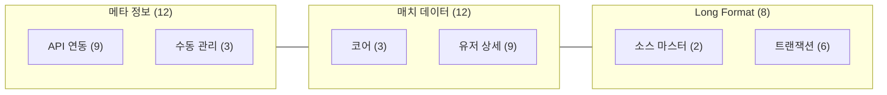
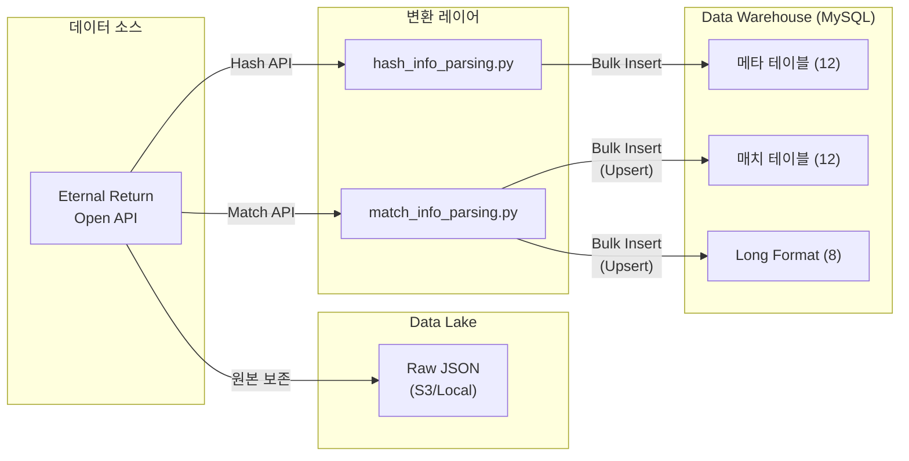

# Eternal Return Crawler - 데이터 카탈로그 (Data Catalog)

> **문서 버전**: v1.0 | **최종 수정**: 2026-03-09 | **대상 시즌**: Season 9

---

## 목차

1. [데이터 자산 개요](#데이터-자산-개요)
2. [도메인별 데이터 자산 목록](#도메인별-데이터-자산-목록)
3. [핵심 용어 사전 (Glossary)](#핵심-용어-사전-glossary)
4. [데이터 계보 (Data Lineage)](#데이터-계보-data-lineage)
5. [데이터 품질 규칙](#데이터-품질-규칙)
6. [분석 시나리오별 테이블 조합 가이드](#분석-시나리오별-테이블-조합-가이드)

---

## 데이터 자산 개요

### 규모

| 항목 | 값 |
|------|-----|
| 총 테이블 수 | **32개** (ORM 클래스 기준) |
| 데이터 소스 | Eternal Return Open API (`open-api.bser.io`) |
| 수집 범위 | 한국 서버(`server_code=10`), 랭크 매치(`matching_mode=3`) |
| 갱신 주기 | 매치 데이터: 5분, 메타 데이터: 1일 |
| 저장소 | MySQL 8.0 (Data Warehouse), S3/Local (Data Lake — Raw JSON) |
| 스키마 관리 | SQLAlchemy ORM + Alembic Migration |

### 테이블 분류 체계



| 도메인 | 테이블 수 | 갱신 주기 | 설명 |
|--------|:---------:|:---------:|------|
| **메타 정보** | 12 | Daily / 수동 | 게임 정적 데이터 (캐릭터, 아이템, 지역 등) |
| **매치 코어** | 3 | 5분 | 매치·팀·유저 매칭 기본 정보 |
| **매치 유저 상세** | 9 | 5분 | 유저별 전투, 장비, MMR, 데미지 등 Wide Format |
| **Long Format** | 8 | 5분 + Auto | 정규화된 가변 데이터 (크레딧, 특성, 오브젝트, 가젯) |
| **합계** | **32** | | |

---

## 도메인별 데이터 자산 목록

### 1. 메타 정보 테이블

#### 1.1 API 연동 메타 테이블 (9개)

> 게임 패치에 따라 변경되므로 **복합 PK** `(entity_id, season, major_version, minor_version)` 체계.

| # | 테이블명 | 비즈니스 목적 | PK | 주요 컬럼 | 소스 API | 갱신 주기 |
|---|----------|---------------|-----|-----------|----------|-----------|
| 1 | `user` | 유저 마스터, 크롤링 상태 추적 | `user_num` (Auto) | `uid`(UK), `nickname`, `last_match_id`, `is_active` | `get_top_ranker()`, `fetch_user_by_nickname_async()` | 실시간 |
| 2 | `character_info` | 실험체(캐릭터) 기본 스탯 | `(character_id, season, major_version, minor_version)` | `character_name`, `archetype_*`, `base_*` | `get_character()` | Daily |
| 3 | `character_levelup_stats` | 캐릭터 레벨업 스탯 증가량 | `(character_id, season, major_version, minor_version)` | `levelup_max_hp`, `levelup_attack_power`, `levelup_defense`, `levelup_hp_regen` | `get_character()` | Daily |
| 4 | `item_weapon` | 무기 아이템 정보 | `(item_id, season, major_version, minor_version)` | `item_name`, `weapon_type`, `item_grade`, 전투 스탯 | `get_equipment()` | Daily |
| 5 | `item_armor` | 방어구 아이템 정보 | `(item_id, season, major_version, minor_version)` | `item_name`, `armor_type`, `item_grade`, 전투 스탯 | `get_equipment()` | Daily |
| 6 | `monster_info` | 야생동물/에픽 몬스터 정보 | `(monster_id, season, major_version, minor_version)` | `monster_name`, `monster_grade`, `is_mutant`, 전투 스탯 | `get_monster()` | Daily |
| 7 | `area_info` | 맵 지역 정보 | `(area_id, season, major_version, minor_version)` | `area_name` | `get_area()` | Daily |
| 8 | `trait_info` | 특성(Trait) 정보 | `(trait_id, season, major_version, minor_version)` | `trait_name` | `get_l10n()` | Daily |
| 9 | `weather_info` | 날씨 정보 | `(weather_id, season, major_version, minor_version)` | `weather_name` | `get_area()` | Daily |
| 10 | `installation_info` | 설치물 정보 | `(installation_id, season, major_version, minor_version)` | `installation_name` | API | Daily |

#### 1.2 수동 관리 테이블 (3개)

> 코드 내 하드코딩 또는 수동 INSERT로 관리.

| # | 테이블명 | 비즈니스 목적 | PK | 주요 컬럼 | 관리 방식 |
|---|----------|---------------|-----|-----------|-----------|
| 1 | `weapon_types` | 무기 타입 코드 ↔ 이름 매핑 | `weapon_id` | `weapon_name` (UK) | `hash_info_parsing.weapon_type()` |
| 2 | `armor_types` | 방어구 타입 코드 ↔ 이름 매핑 | `armor_id` | `armor_name` (UK) | 수동 INSERT |
| 3 | `tactical_skills` | 전술 스킬 코드 ↔ 이름 매핑 | `tactical_skill_id` | `tactical_skill_name` (UK) | `hash_info_parsing.tactical_type()` |

---

### 2. 매치 데이터 테이블

#### 2.1 코어 테이블 (3개)

> 매치 ↔ 팀 ↔ 유저의 **스타 스키마** 구조. `match_user_start`가 Fact 테이블 역할.

| # | 테이블명 | 비즈니스 목적 | PK | 관계 | 핵심 특징 |
|---|----------|---------------|-----|------|-----------|
| 1 | `match_info` | 매치 메타 정보 (최상위) | `match_id` | ← `match_team_info` | `start_dtm` INDEX, `expired_tm` 포함 |
| 2 | `match_team_info` | 팀 단위 성과 | `(match_id, team_number)` | FK→`match_info`, ← `match_user_start` | 순위, 팀킬, 탈출 상태 |
| 3 | `match_user_start` | **유저-매치 중심 Fact 테이블** | `(match_id, user_num)` | FK→`match_info`, `user`, `match_team_info` | 모든 유저 상세 테이블의 부모 |

#### 2.2 유저 상세 테이블 (9개)

> 모두 `match_user_start`를 부모로 참조 (FK: `match_id, user_num`).

| # | 테이블명 | 비즈니스 목적 | 주요 컬럼 (models.py 기준) |
|---|----------|---------------|---------------------------|
| 1 | `match_user_end` | 매치 종료 시점 활동 | `victory`, `play_time`, `watch_time`, `total_time`, `time_spent_in_briefing_room`, `craft_uncommon`~`craft_mythic`, `use_hyperloop`, `use_security_console`, `break_count`, `enter_dimension_rift`, `enter_dimension_empowered_rift`, `win_dimension_rift`, `win_dimension_empowered_rift`, `resurrectionkit_count`, `resurrectionkit_credit_count`, `fishing_count`, `emoticon_count`, `used_pairloop`, `give_up`, `team_spectator`, `is_leaving_before_credit_revival_terminate` |
| 2 | `match_user_combat` | 전투 통계 | `character_level`, `tactical_skill_level`, `player_kill`, `player_assistant`, `player_deaths`, `monster_kill`, `kills_phase_one`~`three`, `deaths_phase_one`~`three`, `terminate_count`, `terminate_count_cannot_eliminate`, `clutch_count`, `unknown_kill`, `cc_time_to_player`, `credit_revival_count`, `credit_revived_others_count`, `reunited_count`, `tactical_skill_count` |
| 3 | `match_user_damage` | 데미지 상세 (유형별) | `damage_to_player_*` (total, basic, skill, item_skill, direct, trap, unique_skill, shield), `damage_from_player_*`, `damage_to_monster_*`, `damage_from_monster_total`, `damage_offseted_by_shield_player`, `damage_offseted_by_shield_monster`, `damage_to_guide_robot`, `heal_amount`, `team_recover`, `protect_absorb` |
| 4 | `match_user_equipment` | 장비 이력 | `first_weapon`~`first_leg`, `last_weapon`~`last_leg`, `best_weapon`, `best_weapon_level` |
| 5 | `match_user_stats` | 최종 능력치 스냅샷 | `max_hp`, `hp_regen`, `attack_power`, `attack_speed`, `defense`, `skill_amp`, `move_speed`, `ooc_move_speed`, `sight_range`, `attack_range`, `adaptive_force`, `adaptive_force_attack`, `adaptive_force_amp`, `critical_strike_chance`, `critical_damage`, `cooldown_reduction`, `life_steal`, `normal_life_steal`, `skill_life_steal` |
| 6 | `match_user_mmr` | MMR 변동 정보 | `mmr_before`, `mmr_after`, `mmr_gain`, `mmr_gain_in_game`, `mmr_loss_entry_cost`, `rank_point` |
| 7 | `match_user_sight` | 시야/정찰 정보 | `sight_score`, `camera_setup`, `camera_remove`, `emp_drone_setup`, `basic_drone_setup` |

---

### 3. Long Format 테이블

#### 3.1 소스 마스터 테이블 (2개)

> 크레딧 관련 소스 코드의 **룩업 테이블**. `_get_or_create_*_sources()`로 캐시 관리.

| # | 테이블명 | 비즈니스 목적 | PK | 주요 컬럼 |
|---|----------|---------------|-----|-----------|
| 1 | `credit_acquisition_source` | 크레딧 획득 소스 마스터 | `source_id` (Auto) | `source_name` (UK) |
| 2 | `credit_expenditure_source` | 크레딧 소모 소스 마스터 | `source_id` (Auto) | `source_name` (UK) |

#### 3.2 트랜잭션 테이블 (6개)

> 가변 개수 데이터를 정규화. 모두 FK→`match_user_start (match_id, user_num)`.

| # | 테이블명 | 비즈니스 목적 | PK | 카디널리티 |
|---|----------|---------------|-----|------------|
| 1 | `match_user_trait` | 유저 특성 선택 | `(match_id, user_num, trait_id, trait_type)` | 유저당 2~4행 |
| 2 | `match_user_credit_acquisitions` | 크레딧 획득 이벤트 | `(match_id, user_num, acquisition_source_id)` | 유저당 5~15행 |
| 3 | `match_user_credit_expenditures` | 크레딧 소모 이벤트 | `(match_id, user_num, event_seq)` | 유저당 10~30행 |
| 4 | `match_user_credit_time` | 분당 크레딧 흐름 | `(match_id, user_num, minute)` | 유저당 최대 20행 |
| 5 | `match_user_object` | 오브젝트/몬스터 상호작용 | `(match_id, user_num, metric_type, metric_name)` | 유저당 3~10행 |
| 6 | `match_user_gadget` | 가젯 사용 이력 | `(match_id, user_num, gadget_id)` | 유저당 0~5행 |

---

## 핵심 용어 사전 (Glossary)

| 용어 | 정의 | 관련 테이블/컬럼 |
|------|------|------------------|
| **UID** | Eternal Return API의 유저 고유 식별자. 128자 문자열, 불변값. API 정책 변경으로 `userNum` 폐지 후 도입 | `user.uid` |
| **user_num** | 시스템 내부 정수 ID. `uid`를 내부적으로 매핑한 값. Auto Increment | `user.user_num` → FK로 전파 |
| **match_id** | 매치(게임) 고유 ID. API의 `gameId`에 대응. BIGINT | `match_info.match_id` |
| **MMR** | Matchmaking Rating. 유저의 실력을 수치화한 지표. 매치 전후 변동 기록 | `match_user_mmr.*` |
| **크레딧 (Credit)** | 인게임 화폐. 드론·아이템 구매 등에 사용. VF Credits로도 표기 | `match_user_credit_*` |
| **특성 (Trait)** | 게임 내 유저가 선택하는 패시브 능력. `first_sub`, `second_sub` 타입 구분 | `match_user_trait.trait_type` |
| **배치 (Batch)** | 파이프라인에서 한 번에 처리하는 데이터 묶음. 기본 20개 매치 단위 | `pipeline.py` |
| **스노우볼 수집** | 시드 유저(Top 1000 랭커)에서 시작해 매치 내 상대방을 발견·등록하며 확장하는 수집 전략 | `user.is_active`, `pipeline.py` |
| **Resolution Layer** | API에서 닉네임→UID 조회 후 내부 `user_num` 매핑을 수행하는 식별 계층 | `pipeline._identify_and_upsert_users()` |
| **Wide Format** | 한 행에 모든 속성을 컬럼으로 펼친 구조. 고정 스키마에 적합 | `match_user_combat`, `match_user_damage` 등 |
| **Long Format** | 키-값 쌍으로 가변 속성을 행 단위 저장. 정규화에 적합 | `match_user_trait`, `match_user_object` 등 |
| **Upsert** | INSERT + ON DUPLICATE KEY UPDATE. 중복 시 기존 행을 갱신하는 쓰기 전략 | `db_utils.save_data_to_db()` |

---

## 데이터 계보 (Data Lineage)

### 전체 Lineage 개요



### 테이블별 Lineage 상세

| 테이블 | API 엔드포인트 | 파싱 함수 | 적재 함수 | Raw 보존 |
|--------|----------------|-----------|-----------|:--------:|
| `user` | `v1/user/nickname` | `top_ranker_nicknames()` | `upsert_users()` | ✗ |
| `character_info` | `v2/data/Character` | `parse_character_info()` | `save_data_to_db()` | ✗ |
| `character_levelup_stats` | `v2/data/Character` | `parse_character_levelup_stats()` | `save_data_to_db()` | ✗ |
| `item_weapon` | `v2/data/ItemWeapon` | `parse_item_weapon()` | `save_data_to_db()` | ✗ |
| `item_armor` | `v2/data/ItemArmor` | `parse_item_armor()` | `save_data_to_db()` | ✗ |
| `monster_info` | `v2/data/Monster` | `parse_monster_info()` | `save_data_to_db()` | ✗ |
| `area_info` | `v2/data/Area` | `parse_area_info()` | `save_data_to_db()` | ✗ |
| `trait_info` | `v2/data/l10n/Korean` | `parse_from_l10n()` | `save_data_to_db()` | ✗ |
| `match_info` | `v1/games/{gameId}` | `parse_match_info()` | `save_data_to_db()` | ✓ |
| `match_team_info` | `v1/games/{gameId}` | `_parse_team_info_from_game()` | `save_data_to_db()` | ✓ |
| `match_user_start` | `v1/games/{gameId}` | `_parse_user_start_from_game()` | `save_data_to_db()` | ✓ |
| `match_user_end` | `v1/games/{gameId}` | `_parse_user_end_from_game()` | `save_data_to_db()` | ✓ |
| `match_user_combat` | `v1/games/{gameId}` | `_parse_user_combat_from_game()` | `save_data_to_db()` | ✓ |
| `match_user_damage` | `v1/games/{gameId}` | `_parse_user_damage_from_game()` | `save_data_to_db()` | ✓ |
| `match_user_equipment` | `v1/games/{gameId}` | `_parse_user_end_from_game()` | `save_data_to_db()` | ✓ |
| `match_user_stats` | `v1/games/{gameId}` | `_parse_user_stats_from_game()` | `save_data_to_db()` | ✓ |
| `match_user_mmr` | `v1/games/{gameId}` | `_parse_user_end_from_game()` | `save_data_to_db()` | ✓ |
| `match_user_sight` | `v1/games/{gameId}` | `_parse_user_sight_from_game()` | `save_data_to_db()` | ✓ |
| `match_user_trait` | `v1/games/{gameId}` | `_parse_user_traits_from_game()` | `save_data_to_db()` | ✓ |
| `match_user_credit_acquisitions` | `v1/games/{gameId}` | `_parse_credit_acquisitions_from_game()` | `save_data_to_db()` | ✓ |
| `match_user_credit_expenditures` | `v1/games/{gameId}` | `_parse_credit_expenditures_from_game()` | `save_data_to_db()` | ✓ |
| `match_user_credit_time` | `v1/games/{gameId}` | `_parse_user_credit_time_from_game()` | `save_data_to_db()` | ✓ |
| `match_user_object` | `v1/games/{gameId}` | `_parse_user_objects_from_game()` | `save_data_to_db()` | ✓ |
| `match_user_gadget` | `v1/games/{gameId}` | `_parse_user_gadget_from_game()` | `save_data_to_db()` | ✓ |

---

## 데이터 품질 규칙

### PK 무결성

| 규칙 | 적용 대상 | 메커니즘 |
|------|-----------|----------|
| 매치 중복 방지 | `match_info` | `check_match_exists()` + `ON DUPLICATE KEY UPDATE` |
| 유저 중복 방지 | `user` | `uid` UNIQUE 제약 + `upsert_users()` |
| FK 정합성 | 모든 매치 유저 테이블 | `match_user_start` 선 적재 → 자식 테이블 후 적재 |

### NULL 정책

| 도메인 | 정책 |
|--------|------|
| 메타 정보 | PK 컬럼은 NOT NULL, 이름 컬럼은 NULL 허용 |
| 매치 Fact | FK 컬럼 NOT NULL. `match_user_start.user_num`은 Resolution Layer에서 보장 |
| 매치 수치 | API 미응답 시 0 또는 NULL. 대부분 기본값 미설정 (NULL) |
| Long Format | PK 컬럼 NOT NULL, 값 컬럼은 0 또는 NULL |

### 알려진 제한사항

| # | 제한사항 | 영향 | 대응 |
|---|----------|------|------|
| 1 | **탈퇴/휴면 유저** | API 404 반환 | `is_active = FALSE` 설정, 수집 제외 |
| 2 | **닉네임 변경** | `user.nickname`과 `match_user_start.nickname` 불일치 가능 | 매치 당시 닉네임은 `match_user_start`에 기록 |
| 3 | **시간대** | `start_dtm`는 UTC 기준 저장 | KST 변환(`UTC+9`) 필요 |
| 4 | **메타 버전 관리** | `minor_version = 0` 고정 | 메이저 패치 단위로만 메타 갱신 |
| 5 | **봇 데이터** | ML 봇이 실제 유저처럼 포함 | `match_user_start.ml_bot = TRUE`로 필터링 |

---

## 분석 시나리오별 테이블 조합 가이드

### 시나리오 1: 캐릭터 밸런스 분석

> **목적**: 캐릭터별 승률·픽률·KDA 분석

| 필수 테이블 | 조인 키 | 역할 |
|-------------|---------|------|
| `match_user_start` | — | 코어 (캐릭터 선택) |
| `match_user_end` | `match_id, user_num` | 승리 여부 |
| `match_user_combat` | `match_id, user_num` | K/D/A |
| `character_info` | `character_num = character_id` | 캐릭터 이름 |
| `match_info` | `match_id` | 시간/버전 필터 |

```sql
SELECT ci.character_name,
       COUNT(*) AS pick_count,
       AVG(CASE WHEN ue.victory THEN 1.0 ELSE 0.0 END) AS win_rate,
       AVG(uc.player_kill) AS avg_kill,
       AVG(uc.player_deaths) AS avg_death,
       AVG(uc.player_assistant) AS avg_assist
FROM match_user_start us
JOIN match_user_end ue USING (match_id, user_num)
JOIN match_user_combat uc USING (match_id, user_num)
JOIN character_info ci ON us.character_num = ci.character_id AND ci.season = 9
JOIN match_info mi USING (match_id)
WHERE mi.start_dtm >= '2026-03-01'
  AND us.ml_bot = FALSE
GROUP BY ci.character_name
ORDER BY pick_count DESC;
```

---

### 시나리오 2: 인게임 경제 분석

> **목적**: 크레딧 획득/소모 패턴, 경제적 우위와 승률 상관관계

| 필수 테이블 | 역할 |
|-------------|------|
| `match_user_credit_acquisitions` | 획득 이벤트 |
| `match_user_credit_expenditures` | 소모 이벤트 |
| `match_user_credit_time` | 분별 크레딧 흐름 |
| `credit_acquisition_source` | 획득 소스 이름 |
| `credit_expenditure_source` | 소모 소스 이름 |
| `match_user_end` | 승리 여부와 연계 |

---

### 시나리오 3: 장비 빌드 메타 분석

> **목적**: 인기 장비 조합, 최종 장비별 승률

| 필수 테이블 | 역할 |
|-------------|------|
| `match_user_equipment` | 첫/최종 장비 ID |
| `item_weapon` / `item_armor` | 아이템 이름·등급·스탯 |
| `match_user_end` | 승리 여부 |
| `match_user_start` | 캐릭터·유저 정보 |

---

### 시나리오 4: MMR 구간별 플레이 패턴

> **목적**: 고MMR vs 저MMR 유저의 행동 차이 분석

| 필수 테이블 | 역할 |
|-------------|------|
| `match_user_mmr` | MMR 구간 분류 |
| `match_user_combat` | 전투 스타일 비교 |
| `match_user_damage` | 데미지 패턴 |
| `match_user_object` | 오브젝트 확보율 |
| `match_user_sight` | 시야 확보 행태 |

---

### 시나리오 5: 시야/정찰 기여도 분석

> **목적**: 시야 점수와 승률/팀 성과 상관관계

| 필수 테이블 | 역할 |
|-------------|------|
| `match_user_sight` | 시야 점수, 드론 사용 |
| `match_team_info` | 팀 순위 |
| `match_user_end` | 승리 여부 |
---

## 버전 이력

| 버전 | 날짜 | 변경 사항 |
|------|------|----------|
| v1.0 | 2026-03-09 | 초기 버전. `models.py` 기준 32개 테이블 카탈로그 작성 |
