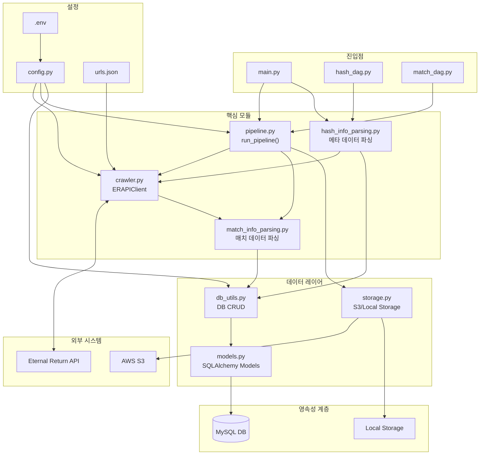
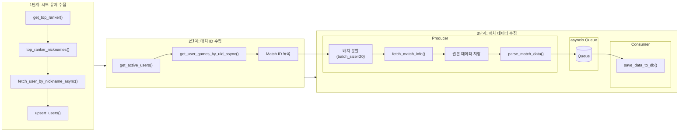
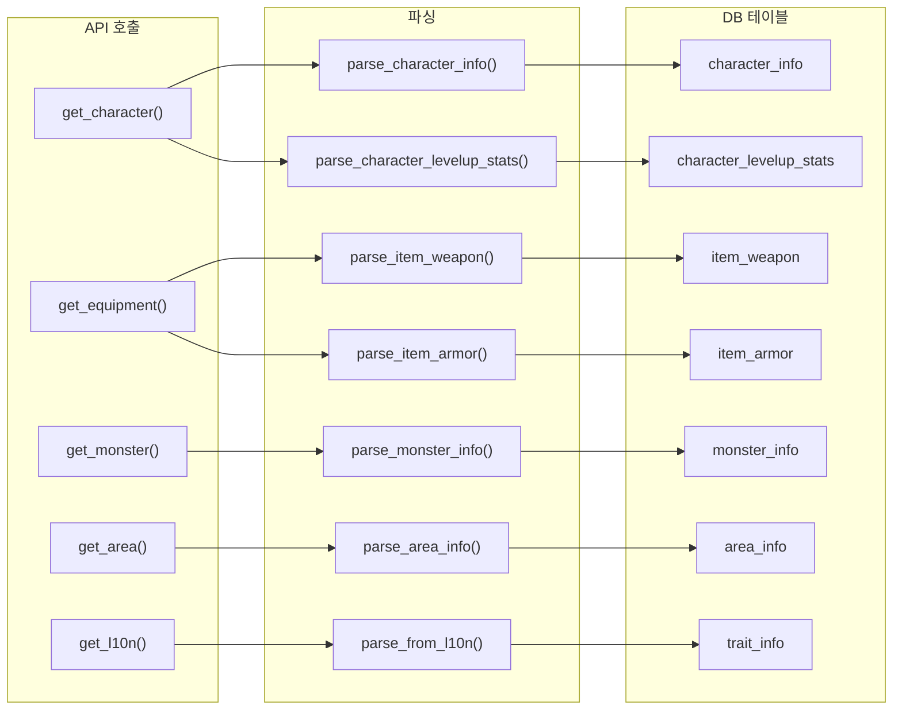
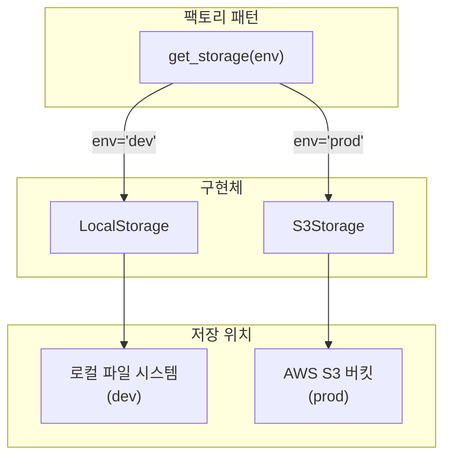

# Eternal Return Crawler - 데이터 흐름도 (Data Flow Diagram)

> **문서 버전**: v1.1 | **최종 수정**: 2026-03-09 | **Schema 기준**: Alembic `38cbb6ad2222`

## 전체 시스템 아키텍처

---

## 데이터 수집 파이프라인 상세 흐름

---

## 매치 데이터 파싱 상세 흐름

```mermaid
flowchart TB
    subgraph Input["입력"]
        RAW_JSON["원본 매치 JSON"]
    end

    subgraph Parsers["파싱 함수들"]
        PMI["parse_match_info()"]
        PTI["_parse_team_info_from_game()"]
        PUS["_parse_user_start_from_game()"]
        PUE["_parse_user_end_from_game()"]
        PUC["_parse_user_combat_from_game()"]
        PUT["_parse_user_traits_from_game()"]
        PUD["_parse_user_damage_from_game()"]
        PCA["_parse_credit_acquisitions_from_game()"]
        PCE["_parse_credit_expenditures_from_game()"]
        PUO["_parse_user_objects_from_game()"]
        PUSTAT["_parse_user_stats_from_game()"]
        PUSIGHT["_parse_user_sight_from_game()"]
        PUGAD["_parse_user_gadget_from_game()"]
    end

    subgraph Output["출력 테이블"]
        T_MI["match_info"]
        T_TI["match_team_info"]
        T_UMS["match_user_start"]
        T_UME["match_user_end"]
        T_UC["match_user_combat"]
        T_UT["match_user_trait"]
        T_UD["match_user_damage"]
        T_CA["match_user_credit_acquisitions"]
        T_CE["match_user_credit_expenditures"]
        T_UO["match_user_object"]
        T_USTAT["match_user_stats"]
        T_USIGHT["match_user_sight"]
        T_UGAD["match_user_gadget"]
    end

    RAW_JSON --> PMI --> T_MI
    RAW_JSON --> PTI --> T_TI
    RAW_JSON --> PUS --> T_UMS
    RAW_JSON --> PUE --> T_UME
    RAW_JSON --> PUC --> T_UC
    RAW_JSON --> PUT --> T_UT
    RAW_JSON --> PUD --> T_UD
    RAW_JSON --> PCA --> T_CA
    RAW_JSON --> PCE --> T_CE
    RAW_JSON --> PUO --> T_UO
    RAW_JSON --> PUSTAT --> T_USTAT
    RAW_JSON --> PUSIGHT --> T_USIGHT
    RAW_JSON --> PUGAD --> T_UGAD
```

---

## 메타 데이터(Hash) 수집 흐름

---

## 저장소 패턴

---

## 주요 함수별 Docstring

### 1. crawler.py - ERAPIClient

| 함수 | 설명 |
|------|------|
| __aenter__() | 비동기 컨텍스트 매니저 진입 시 aiohttp 세션 생성 |
| __aexit__() | 비동기 컨텍스트 매니저 종료 시 세션 종료 |
| _fetch_json(url, params, max_retries, initial_delay, response_model) | 재시도 로직과 Rate Limiting을 포함하여 JSON을 가져오는 내부 메서드. Pydantic 모델 검증 지원 |
| get_character() | 실험체 기본 스탯 및 레벨업 능력치 데이터 조회 |
| get_equipment() | 방어구/무기 아이템 데이터 조회 |
| get_trait() | 특성(Trait) 데이터 조회 |
| get_monster() | 야생동물 및 에픽 몬스터 데이터 조회 |
| get_area() | 지역(Area) 데이터 조회 |
| get_l10n() | 한국어 L10N 텍스트 파일 조회 |
| get_top_ranker(season_id, matching_mode, server_code) | 상위 1000 랭커 정보 조회 |
| fetch_user_by_nickname_async(nickname) | 닉네임으로 단일 사용자 정보 조회 |
| get_users_by_nickname_async(nicknames) | 닉네임 목록으로 복수 사용자 정보 병렬 조회 |
| fetch_user_games(url) | 사용자 매치 기록 페이지 조회 |
| get_user_games_by_uid_async(users) | 사용자 UID로 신규 매치 ID 수집 (AsyncGenerator) |
| fetch_match_info(match_id) | 단일 매치 상세 정보 조회 |
| get_match_infos_async(match_ids, batch_size) | 매치 ID 목록으로 매치 정보 배치 조회 (AsyncGenerator) |

---

### 2. pipeline.py - 데이터 파이프라인

| 함수 | 설명 |
|------|------|
| log_memory() | 현재 프로세스의 메모리 사용량을 로깅 |
| seed_top_rankers() | Top 1000 랭커를 가져와 DB에 시드 유저로 추가. 닉네임 → UID 조회 → Upsert 수행 |
| _fetch_and_save_raw_data(client, batch_match_ids, batch_index, storage) | API에서 매치 데이터를 수집하고 원본 JSON을 저장 |
| _identify_and_upsert_users(client, engine, batch_user_nicknames) | 배치 내 유저를 식별하고 신규 유저를 DB에 등록. `nickname_to_uid_map` 반환 |
| _parse_and_prepare_batch_data(engine, raw_match_data_list, nickname_to_uid_map) | 매치 데이터를 파싱하고 DB 적재용 데이터로 변환. `{table_name: [records]}` 형태 반환 |
| produce_batches(client, match_ids, queue, engine, storage) | **Producer**: API 데이터 수집 → 파싱 → Queue에 적재 |
| consume_batches(engine, queue) | **Consumer**: Queue에서 데이터를 꺼내 DB에 저장 |
| run_pipeline() | 데이터 수집 파이프라인 메인 함수. 시드 데이터 확인 → 유저별 매치 수집 → Producer-Consumer 패턴으로 병렬 처리 |

---

### 3. db_utils.py - 데이터베이스 유틸리티

| 함수 | 설명 |
|------|------|
| get_engine() | SQLAlchemy 엔진 인스턴스 반환 |
| check_match_exists(engine, match_ids) | DB에 이미 존재하는 매치 ID들을 조회하여 set으로 반환 |
| get_user_num_map_by_uids(engine, uids) | UID 리스트 → `{uid: user_num}` 매핑 반환 |
| get_uids_by_nicknames(engine, nicknames) | 닉네임 리스트 → `{nickname: uid}` 매핑 반환 |
| _get_or_create_sources_generic(...) | 크레딧 획득/소모 소스 공통 처리 (캐시 활용) |
| _get_or_create_acquisition_sources(engine, sources) | 크레딧 획득 소스 매핑 반환 (신규 시 생성) |
| _get_or_create_expenditure_sources(engine, items) | 크레딧 소모 소스 매핑 반환 (신규 시 생성) |
| _save_single_list(engine, table_name, data_list) | 단일 리스트를 DB 테이블에 저장 (ON DUPLICATE KEY UPDATE) |
| save_data_to_db(engine, parsed_data) | 파싱된 데이터 전체를 DB에 저장. 테이블 간 의존성 고려하여 순차/병렬 저장 |
| execute_sql_file(engine, file_path) | SQL 파일을 읽어 실행 (스키마 초기화용) |
| get_active_users_count(engine) | 활성 유저(is_active=True) 수 조회 |
| get_active_users(engine, limit) | 활성 유저 목록 조회 (last_updated_at 오름차순) |
| upsert_users(engine, users_data) | 유저 정보 Upsert (신규 추가 또는 닉네임 갱신) |
| deactivate_user(engine, uid) | 특정 유저 비활성화 (is_active=False) |
| update_user_last_match(engine, uid, last_match_id) | 단일 유저의 last_match_id 갱신 |
| update_user_last_match_bulk(engine, user_updates) | 여러 유저의 last_match_id 일괄 갱신 |

---

### 4. match_info_parsing.py - 매치 데이터 파싱

| 함수 | 설명 |
|------|------|
| top_ranker_nicknames(data) | topRanks 데이터에서 상위 랭커의 닉네임 리스트 추출 |
| parse_match_info(data) | 매치 기본 정보(게임 ID, 시작 시간, 버전 등) 파싱 |
| _parse_team_info_from_game(u, processed_team_ids) | 팀 정보 파싱 (중복 팀 번호 처리 포함) |
| _parse_user_start_from_game(u) | 유저 매치 시작 정보(캐릭터, 스킨, 시작 지역 등) 파싱 |
| _parse_user_end_from_game(u) | 매치 종료 시점의 유저 정보(등수, 레벨, 장비 등) 파싱 |
| _parse_user_combat_from_game(u) | 유저 전투 정보(킬, 어시스트, 데미지 등) 파싱 |
| _parse_user_traits_from_game(u) | 유저 특성(Trait) 정보 파싱 |
| _parse_user_damage_from_game(u) | 유저별 데미지 상세 정보 파싱 |
| _parse_credit_acquisitions_from_game(u, source_mapping, skip_cr_sources) | 유저별 크레딧 획득 정보 파싱 |
| _parse_credit_expenditures_from_game(u, mappings, drone_item_mapping, other_item_cr) | 유저별 크레딧 지출 정보 파싱 |
| _parse_user_objects_from_game(u, obj_mappings) | 유저별 오브젝트/에픽 몬스터 상호작용 정보 파싱 |
| _parse_user_credit_time_from_game(u) | 유저별 시간대별 크레딧 정보 파싱 |
| _parse_user_stats_from_game(u) | 유저 능력치 정보 파싱 |
| _parse_user_sight_from_game(u) | 유저 시야/카메라 관련 정보 파싱 |
| _parse_user_gadget_from_game(u) | 유저 가젯 사용 정보 파싱 |
| parse_match_data(data) | 전체 매치 데이터를 파싱하여 테이블별 레코드로 변환 |

---

### 5. hash_info_parsing.py - 메타 데이터 파싱

| 함수 | 설명 |
|------|------|
| weapon_type() | 무기 타입 ID-이름 매핑 반환 |
| tactical_type() | 전술 스킬 ID-이름 매핑 반환 |
| parse_area_info(data, season, major_version, minor_version) | 지역 정보를 area_info 테이블 형태로 변환 |
| parse_from_l10n(data, parse_key, season, major_version, minor_version) | L10N 데이터에서 특성 등 정보를 파싱하여 딕셔너리 리스트로 변환 |
| parse_character_info(data, season, major_version, minor_version) | Character.json → character_info 테이블용 레코드 리스트 |
| parse_character_levelup_stats(data) | CharacterLevelUpStat.json → character_levelup_stats 테이블용 레코드 리스트 |
| parse_item_weapon(data, season, major_version, minor_version) | ItemWeapon.json → item_weapon 테이블용 레코드 리스트 |
| parse_item_armor(data, season, major_version, minor_version) | ItemArmor.json → item_armor 테이블용 레코드 리스트 |
| parse_monster_info(data, season, major_version, minor_version) | Monster.json → monster_info 테이블용 레코드 리스트 (중복 제거) |
| parse_all_meta_files(client, l10n_data, season, major_version, minor_version) | 모든 메타 정보 JSON 파일을 파싱하여 테이블별 레코드 반환 |

---

### 6. storage.py - 저장소

| 클래스/함수 | 설명 |
|-------------|------|
| DataStorage (ABC) | 데이터 저장소 추상 기본 클래스 |
| LocalStorage | 로컬 파일 시스템 저장소 구현체 |
| S3Storage | AWS S3 저장소 구현체 |
| get_storage(env) | 환경 변수에 따라 적절한 Storage 객체를 반환하는 팩토리 함수 |

---

### 7. main.py - 진입점

| 함수 | 설명 |
|------|------|
| populate_static_tables(client) | 게임 정적 데이터(캐릭터, 아이템 등)를 가져와 파싱하고 테이블이 비어있는 경우 DB에 저장 |
| run_full_process() | 전체 수집 프로세스 실행: 정적 데이터 확인 → 매치 파이프라인 실행 |
| run_hash_process() | 정적 데이터(메타) 수집 프로세스만 실행 |
| run_match_process() | 매치 데이터 수집 프로세스만 실행 |
| main() | CLI 진입점. run/seed/hash/match 명령어 처리 |

---

## 핵심 설계 패턴

| 패턴 | 적용 위치 | 설명 |
|------|-----------|------|
| **Producer-Consumer** | pipeline.py | asyncio.Queue를 활용한 비동기 파이프라인 |
| **Rate Limiting** | crawler.py | aiolimiter를 사용한 API 호출량 제한 (초당 50 요청) |
| **Exponential Backoff** | crawler.py | 재시도 시 지수적 대기 시간 증가 |
| **Factory Pattern** | storage.py | 환경에 따른 저장소 객체 생성 |
| **Strategy Pattern** | storage.py | LocalStorage/S3Storage 교체 가능 |
| **Context Manager** | crawler.py | `async with` 구문으로 세션 수명 관리 |
| **Caching** | db_utils.py | 크레딧 소스 ID 인메모리 캐싱 |

---

## 운영 파라미터

| 파라미터 | 값 | 위치 |
|-----------|-----|------|
| Queue maxsize | 3 | `pipeline.py` |
| Batch size | 20 | `pipeline.py` |
| Rate limit | 50 req/s | `crawler.py` |
| Max retries | 3 | `crawler.py` |
| USER_BATCH_LIMIT | 30,000 (env) | `.env` / `config.py` |
| DB_MAX_WORKERS | 8 (env) | `.env` / `config.py` |
