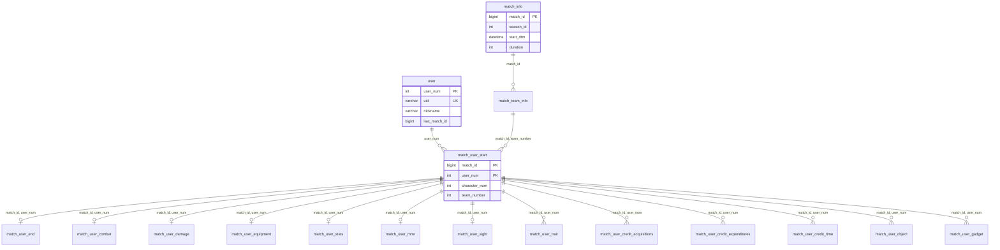

# Eternal Return Crawler - 데이터 명세서

> **문서 버전**: v2.3 | **최종 수정**: 2026-03-09 | **대상 시즌**: Season 9
> **Schema 기준**: Alembic `38cbb6ad2222` (initial_schema)

---

## 목차
1. [개요](#개요)
2. [데이터베이스 ERD](#데이터베이스-erd)
3. [테이블 분류 및 구성](#테이블-분류-및-구성)
4. [메타 정보 테이블](#1-메타-정보-테이블)
5. [매치 데이터 테이블](#2-매치-데이터-테이블)
6. [Long Format 테이블](#3-long-format-테이블)
7. [데이터 수집 정책](#데이터-수집-정책)
8. [데이터 품질 및 주의사항](#데이터-품질-및-주의사항)
9. [활용 가이드](#활용-가이드)

---

## 개요

### 프로젝트 목적
이터널 리턴(Eternal Return) 게임의 공식 API를 통해 매치 데이터를 수집하고, 분석 가능한 형태로 정규화하여 MySQL 데이터베이스에 저장합니다.

### 데이터 소스
- **Eternal Return Open API**: `https://open-api.bser.io`
- **수집 대상**: 랭크(Rank) 매치만 수집 (`matching_mode = 3`)
- **수집 범위**: Top 1000 랭커로부터 시작하여 스노우볼 방식으로 확장

### 핵심 식별자

| 식별자 | 설명 | 특징 |
|--------|------|------|
| `match_id` | 매치 고유 ID | API의 `gameId`, BIGINT |
| `uid` | 유저 API 식별자 | 128자 문자열, 불변 |
| `user_num` | 내부 유저 ID | Auto Increment, FK로 사용 |
| `character_num` | 캐릭터 ID | `character_info.character_id`와 조인 |

---

## 데이터베이스 ERD



---

## 테이블 분류 및 구성

| 분류 | 테이블 수 | 설명 |
|------|-----------|------|
| **메타 정보** | 12개 | 게임 정적 데이터 (버전별 관리) |
| **매치 데이터** | 12개 | 매치별 유저 데이터 (Wide Format) |
| **Long Format** | 6개 | 가변 개수 데이터 (정규화) |
| **소스 마스터** | 2개 | 크레딧 획득/소모 소스 룩업 테이블 |
| **합계** | **32개** | |

---

## 1. 메타 정보 테이블

### 버전 관리 체계
메타 정보는 게임 패치에 따라 변경될 수 있어 **버전별로 복합 키**를 사용합니다.

```
PK = (entity_id, season, major_version, minor_version)
```

> [!NOTE]
> 현재 수집 시 `minor_version = 0`으로 고정하여 메이저 패치 단위로 관리합니다.

---

### 1.1 user
유저 정보 및 크롤링 상태를 관리하는 핵심 테이블입니다.

| 컬럼 | 타입 | 설명 |
|------|------|------|
| `user_num` | INT PK | 내부 유저 ID (Auto Increment) |
| `uid` | VARCHAR(128) UK | API 유저 식별자 |
| `nickname` | VARCHAR(30) | 현재 닉네임 |
| `last_match_id` | BIGINT | 마지막으로 수집한 매치 ID |
| `is_active` | BOOLEAN | 활성 유저 여부 |
| `last_updated_at` | DATETIME | 마지막 업데이트 시간 |

> [!TIP]
> `last_match_id`보다 큰 매치만 수집하여 중복을 방지합니다. `is_active = FALSE`인 유저는 탈퇴/휴면 계정으로 수집 대상에서 제외됩니다.

---

### 1.2 character_info
실험체(캐릭터) 기본 정보입니다.

| 컬럼 | 타입 | 설명 |
|------|------|------|
| `character_id` | INT PK | 캐릭터 ID |
| `season` | INT PK | 시즌 번호 |
| `major_version` | INT PK | 메이저 버전 |
| `minor_version` | INT PK | 마이너 버전 |
| `character_name` | VARCHAR(255) | 캐릭터 이름 |
| `archetype_primary` | VARCHAR(255) | 주 역할군 |
| `archetype_secondary` | VARCHAR(255) | 부 역할군 |
| `weapon_range_type` | VARCHAR(255) | 원거리/근거리 타입 |
| `base_max_hp` | INT | 기본 최대 체력 |
| `base_attack_power` | INT | 기본 공격력 |
| `base_defense` | INT | 기본 방어력 |
| `base_skill_amp` | INT | 기본 스킬 증폭 |
| `base_hp_regen` | FLOAT | 기본 체력 재생 |
| `base_attack_speed` | FLOAT | 기본 공격 속도 |
| `base_move_speed` | FLOAT | 기본 이동 속도 |
| `base_sight_range` | FLOAT | 기본 시야 범위 |

---

### 1.3 item_weapon / item_armor
무기 및 방어구 아이템 정보입니다. 장비 분석 시 `match_user_equipment`와 조인합니다.

| 컬럼 | 타입 | 설명 |
|------|------|------|
| `item_id` | INT PK | 아이템 ID |
| `item_name` | VARCHAR(255) | 아이템 이름 |
| `item_grade` | VARCHAR(255) | 등급 (Uncommon/Rare/Epic/Legend/Mythic) |
| `weapon_type` / `armor_type` | VARCHAR(255) | 무기/방어구 타입 |
| `attack_power` | INT | 공격력 |
| `defense` | INT | 방어력 |
| `skill_amp` | INT | 스킬 증폭 |
| `max_hp` | INT | 최대 체력 |

### 1.4 기타 메타 테이블

| 테이블 | 설명 |
|--------|------|
| character_levelup_stats | 캐릭터 레벨업 당 스탯 증가량 |
| area_info | 지역(맵) 정보 |
| monster_info | 야생동물/에픽 몬스터 정보 |
| trait_info | 특성(Trait) 정보 |
| weather_info | 날씨 정보 |
| installation_info | 설치물 정보 |
| weapon_types | 무기 타입 코드 매핑 (수동) |
| armor_types | 방어구 타입 코드 매핑 (수동) |
| tactical_skills | 전술 스킬 코드 매핑 (수동) |

---

## 2. 매치 데이터 테이블

### 2.1 match_info
매치의 기본 정보를 저장하는 최상위 테이블입니다.

| 컬럼 | 타입 | 설명 | 비고 |
|------|------|------|------|
| `match_id` | INT PK | 매치 고유 ID | API: `gameId` |
| `season_id` | INT | 시즌 ID | |
| `version_season` | INT | 버전 시즌 | |
| `version_major` | INT | 메이저 버전 | |
| `version_minor` | INT | 마이너 버전 | |
| `matching_mode` | INT | 매칭 모드 | 3=랭크 |
| `matching_team_mode` | INT | 팀 모드 | 1=솔로, 2=듀오, 3=스쿼드 |
| `server_name` | VARCHAR(32) | 서버 이름 | |
| `match_size` | INT | 참가 인원 수 | `len(userGames)` |
| `start_dtm` | DATETIME | 매치 시작 시간 | **INDEX** |
| `duration` | INT | 매치 진행 시간(초) | 최소 `totalTime` |
| `expired_tm` | DATETIME | 매치 만료 시간 | |
| `mmr_avg` | INT | 평균 MMR | |
| `main_weather` | INT | 메인 날씨 | |
| `sub_weather` | INT | 서브 날씨 | |
| `bot_added` | INT | 봇 추가 수 | |
| `bot_remain` | INT | 남은 봇 수 | |
| `safe_areas` | INT | 안전 구역 수 | |
| `restricted_area_accelerated` | INT | 금지구역 가속 여부 | |

---

### 2.2 match_team_info
팀 단위 정보입니다.

| 컬럼 | 타입 | 설명 |
|------|------|------|
| `match_id` | INT PK | 매치 ID (FK → match_info) |
| `team_number` | INT PK | 팀 번호 |
| `game_rank` | INT | 팀 순위 |
| `team_kill` | INT | 팀 킬 수 |
| `total_field_kill` | INT | 필드 킬 수 |
| `team_elimination` | INT | 팀 처치 수 |
| `team_down` | INT | 팀 다운 수 |
| `team_repeat_down` | INT | 팀 연속 다운 수 |
| `team_battle_zone_down` | INT | 팀 배틀존 다운 수 |
| `escape_state` | INT | 탈출 상태 |
| `team_down_cannot_eliminate` | INT | 처형 불가 다운 수 |
| `team_down_can_eliminate` | INT | 처형 가능 다운 수 |
| `team_repeat_down_cannot_eliminate` | INT | 처형 불가 연속 다운 수 |
| `team_repeat_down_can_eliminate` | INT | 처형 가능 연속 다운 수 |

---

### 2.3 match_user_start
**유저 매치의 중심 테이블**입니다. 모든 유저 관련 테이블이 이 테이블을 참조합니다.

| 컬럼 | 타입 | 설명 | 비고 |
|------|------|------|------|
| `match_id` | BIGINT PK | 매치 ID | FK → match_info |
| `user_num` | INT PK | 유저 내부 ID | FK → user |
| `nickname` | VARCHAR(128) | 매치 당시 닉네임 | |
| `character_num` | INT | 사용 캐릭터 ID | **INDEX** |
| `team_number` | INT | 팀 번호 | FK → match_team_info |
| `language` | VARCHAR(255) | 클라이언트 언어 | |
| `skin_code` | INT | 스킨 코드 | |
| `premade` | INT | 파티원 수 | |
| `except_premade_team` | INT | 예외 파티 팀 | |
| `route_id_of_start` | INT | 시작 루트 ID | |
| `place_of_start` | INT | 시작 지역 | |
| `using_default_game_option` | BOOLEAN | 기본 설정 사용 여부 | |
| `premade_matching_type` | INT | 파티 매칭 타입 | |
| `tactical_skill_id` | INT | 전술 스킬 ID | **INDEX** |
| `ml_bot` | BOOLEAN | ML 봇 여부 | |

> [!IMPORTANT]
> `user_num`은 `uid`를 내부 정수 ID로 변환한 값입니다. 외부 조인 시 `user` 테이블을 통해 `uid`를 확인하세요.

---

### 2.4 match_user_end
매치 종료 시점의 유저 활동 정보입니다.

| 컬럼 | 타입 | 설명 |
|------|------|------|
| `victory` | BOOLEAN | 승리 여부 |
| `play_time` | INT | 플레이 시간(초) |
| `watch_time` | INT | 관전 시간(초) |
| `total_time` | INT | 총 시간(초) |
| `time_spent_in_briefing_room` | INT | 브리핑룸 체류 시간(초) |
| `craft_uncommon` ~ `craft_mythic` | INT | 등급별 제작 횟수 |
| `use_hyperloop` | INT | 하이퍼루프 사용 횟수 |
| `use_security_console` | INT | 보안 콘솔 사용 횟수 |
| `break_count` | INT | 박스 파괴 횟수 |
| `enter_dimension_rift` | INT | 차원 균열 진입 횟수 |
| `enter_dimension_empowered_rift` | INT | 강화 차원 균열 진입 횟수 |
| `win_dimension_rift` | INT | 차원 균열 승리 횟수 |
| `win_dimension_empowered_rift` | INT | 강화 차원 균열 승리 횟수 |
| `resurrectionkit_count` | INT | 부활 키트 사용 횟수 |
| `resurrectionkit_credit_count` | INT | 크레딧 부활 키트 사용 횟수 |
| `fishing_count` | INT | 낚시 횟수 |
| `emoticon_count` | INT | 이모티콘 사용 횟수 |
| `used_pairloop` | INT | 페어루프 사용 횟수 |
| `give_up` | INT | 포기 횟수 |
| `team_spectator` | INT | 팀 관전 횟수 |
| `is_leaving_before_credit_revival_terminate` | BOOLEAN | 크레딧 부활 전 이탈 여부 |

---

### 2.5 match_user_combat
전투 관련 통계입니다.

| 컬럼 | 타입 | 설명 |
|------|------|------|
| `character_level` | INT | 최종 캐릭터 레벨 |
| `tactical_skill_level` | INT | 전술 스킬 레벨 |
| `player_kill` | INT | 플레이어 킬 수 |
| `player_assistant` | INT | 어시스트 수 |
| `player_deaths` | INT | 사망 수 |
| `monster_kill` | INT | 몬스터 킬 수 |
| `kills_phase_one` ~ `kills_phase_three` | INT | 페이즈별 킬 수 |
| `deaths_phase_one` ~ `deaths_phase_three` | INT | 페이즈별 사망 수 |
| `terminate_count` | INT | 처형 횟수 |
| `terminate_count_cannot_eliminate` | INT | 처형 불가 처형 횟수 |
| `clutch_count` | INT | 클러치 횟수 |
| `unknown_kill` | INT | 원인 불명 킬 수 |
| `cc_time_to_player` | FLOAT | CC기 적중 시간 |
| `credit_revival_count` | INT | 크레딧 부활 횟수 |
| `credit_revived_others_count` | INT | 타인 크레딧 부활 횟수 |
| `reunited_count` | INT | 재합류 횟수 |
| `tactical_skill_count` | INT | 전술 스킬 사용 횟수 |

---

### 2.6 match_user_damage
데미지 상세 정보입니다. **데미지 유형별로 세분화**되어 있습니다.

| 컬럼 그룹 | 설명 |
|-----------|------|
| `damage_to_player_*` | 플레이어에게 가한 데미지 |
| `damage_from_player_*` | 플레이어로부터 받은 데미지 |
| `damage_to_monster_*` | 몬스터에게 가한 데미지 |
| `damage_from_monster_total` | 몬스터로부터 받은 총 데미지 |

**데미지 유형 접미사** (`to_player`, `from_player`, `to_monster` 공통):
- `_total`: 총 데미지
- `_basic`: 기본 공격
- `_skill`: 스킬
- `_item_skill`: 아이템 스킬
- `_direct`: 직접 데미지
- `_trap`: 트랩
- `_unique_skill`: 고유 스킬

**`to_player` 전용 접미사**:
- `_shield`: 보호막 데미지

| 추가 컬럼 | 설명 |
|-----------|------|
| `damage_offseted_by_shield_player` | 보호막으로 상쇄된 플레이어 데미지 |
| `damage_offseted_by_shield_monster` | 보호막으로 상쇄된 몬스터 데미지 |
| `damage_to_guide_robot` | 가이드 로봇(루미)에게 가한 데미지 |
| `heal_amount` | 힐량 |
| `team_recover` | 팀 회복량 |
| `protect_absorb` | 보호막 흡수량 |

---

### 2.7 match_user_equipment
장비 정보입니다.

| 컬럼 | 설명 |
|------|------|
| `first_weapon` ~ `first_leg` | **첫 완성** 장비 (무기/갑옷/투구/팔/다리) |
| `last_weapon` ~ `last_leg` | **최종** 장비 |
| `best_weapon` | 가장 높은 등급 무기 |
| `best_weapon_level` | 가장 높은 무기 레벨 |

> [!TIP]
> 장비 ID는 item_weapon, item_armor 테이블과 조인하여 아이템 이름 및 스탯을 확인할 수 있습니다.

---

### 2.8 match_user_stats
매치 종료 시점의 유저 최종 스탯입니다.

| 컬럼 | 타입 | 설명 |
|------|------|------|
| `max_hp` | INT | 최대 체력 |
| `hp_regen` | FLOAT | 체력 재생 |
| `attack_power` | INT | 공격력 |
| `attack_speed` | FLOAT | 공격 속도 |
| `defense` | INT | 방어력 |
| `skill_amp` | INT | 스킬 증폭 |
| `move_speed` | FLOAT | 이동 속도 |
| `ooc_move_speed` | FLOAT | 비전투 이동 속도 |
| `sight_range` | INT | 시야 범위 |
| `attack_range` | FLOAT | 공격 사거리 |
| `adaptive_force` | FLOAT | 적응형 능력치 |
| `adaptive_force_attack` | FLOAT | 적응형 공격력 |
| `adaptive_force_amp` | FLOAT | 적응형 스킬 증폭 |
| `critical_strike_chance` | FLOAT | 치명타 확률 |
| `critical_damage` | INT | 치명타 데미지 |
| `cooldown_reduction` | INT | 쿨다운 감소 |
| `life_steal` | INT | 생명력 흡수 |
| `normal_life_steal` | INT | 일반 공격 흡혈 |
| `skill_life_steal` | INT | 스킬 흡혈 |

---

### 2.9 match_user_mmr
MMR 변동 정보입니다.

| 컬럼 | 설명 |
|------|------|
| `mmr_before` | 매치 전 MMR |
| `mmr_after` | 매치 후 MMR |
| `mmr_gain` | MMR 변동량 |
| `mmr_gain_in_game` | 인게임 획득 MMR |
| `mmr_loss_entry_cost` | 참가 비용 |
| `rank_point` | 랭크 포인트 |

---

### 2.10 match_user_sight
시야 및 정찰 관련 정보입니다.

| 컬럼 | 설명 |
|------|------|
| `sight_score` | 시야 기여도 점수 |
| `camera_setup` | 카메라 설치 횟수 |
| `camera_remove` | 카메라 제거 횟수 |
| `emp_drone_setup` | EMP 드론 사용 횟수 |
| `basic_drone_setup` | 정찰 드론 사용 횟수 |

---

## 3. Long Format 테이블

가변 개수의 데이터를 정규화하여 저장합니다.

### 3.1 match_user_trait
유저가 선택한 특성 정보입니다. 한 유저당 여러 행이 존재합니다.

| 컬럼 | 타입 | 설명 |
|------|------|------|
| `match_id` | BIGINT PK | 매치 ID |
| `user_num` | INT PK | 유저 ID |
| `trait_id` | INT PK | 특성 ID |
| `trait_type` | VARCHAR(20) | 특성 타입 (`first_sub`, `second_sub`) |

---

### 3.2 match_user_credit_acquisitions
크레딧 획득 정보입니다.

| 컬럼 | 타입 | 설명 |
|------|------|------|
| `match_id` | BIGINT PK | 매치 ID |
| `user_num` | INT PK | 유저 ID |
| `acquisition_source_id` | INT PK | 획득 소스 ID (FK) |
| `acquisition_type` | VARCHAR(32) | 획득 유형 |
| `credit_amount` | FLOAT | 획득 금액 |
| `source_category` | VARCHAR(32) | 소스 카테고리 |

**획득 소스 카테고리**:
| 카테고리 | 설명 | 예시 |
|----------|------|------|
| monster | 야생동물/에픽 몬스터 | KillChicken, KillAlpha |
| player | 플레이어 처치 | KillPlayerMerge, KillAssistDivideContribute |
| env | 환경 요소 | GoldSecurityConsoleAccess, KillOrb |
| timebased | 시간 기반 보상 | TimeElapsedCompensationByMiliSecond |
| bounty | 현상금 | ItemBounty |
| special | 특수 | GetBySkill, TraitSkillCoinToss |

---

### 3.3 match_user_credit_expenditures
크레딧 소모(구매) 정보입니다.

| 컬럼 | 타입 | 설명 |
|------|------|------|
| `match_id` | BIGINT PK | 매치 ID |
| `user_num` | INT PK | 유저 ID |
| `event_seq` | INT PK | 구매 순서 |
| `expenditure_source_id` | INT FK | 소모 소스 ID |
| `expenditure_type` | VARCHAR(32) | 소모 유형 |
| `item_code` | INT | 아이템 코드 (있는 경우) |
| `credit_amount` | INT | 소모 금액 |

---

### 3.4 match_user_credit_time
분당 크레딧 획득/소모 정보입니다.

| 컬럼 | 타입 | 설명 |
|------|------|------|
| `minute` | INT PK | 분 (0-19) |
| `used_credit` | INT | 해당 분에 소모한 크레딧 |
| `gain_credit` | INT | 해당 분에 획득한 크레딧 |

---

### 3.5 match_user_object
오브젝트/에픽 몬스터 상호작용 정보입니다.

| 컬럼 | 타입 | 설명 |
|------|------|------|
| `metric_type` | VARCHAR(32) PK | 메트릭 유형 |
| `metric_name` | VARCHAR(32) PK | 메트릭 이름 |
| `value` | INT | 값 |

**메트릭 유형**:
| metric_type | metric_name 예시 | 설명 |
|-------------|-----------------|------|
| kill_monster | total_kill_monster | 총 몬스터 킬 |
| get_cube | get_cube_red, get_cube_gold 등 | 버프 큐브 획득 |
| kill_alpha, kill_omega 등 | - | 에픽 몬스터 처치 |
| collect_tree_of_life | - | 생명의 나무 수집 |

---

### 3.6 credit_acquisition_source / credit_expenditure_source
크레딧 획득/소모 소스의 마스터(룩업) 테이블입니다.

| 컬럼 | 타입 | 설명 |
|------|------|------|
| `source_id` | INT PK | 소스 ID (Auto Increment) |
| `source_name` | VARCHAR(64) UK | 소스 이름 |

> [!NOTE]
> `match_user_credit_acquisitions.acquisition_source_id` → `credit_acquisition_source.source_id`
> `match_user_credit_expenditures.expenditure_source_id` → `credit_expenditure_source.source_id`

---

### 3.7 match_user_gadget
가젯 사용 정보입니다.

| 컬럼 | 타입 | 설명 |
|------|------|------|
| `gadget_id` | INT PK | 가젯 ID |
| `gadget_count` | INT | 사용 횟수 |

---

## 데이터 수집 정책

### 수집 대상
| 항목 | 값 |
|------|-----|
| 매칭 모드 | 랭크 (`matching_mode = 3`) |
| 서버 | 한국 (`server_code = 10`) |
| 시즌 | 현재 시즌 (config로 설정) |

### 스노우볼 수집 방식


### 중복 방지 메커니즘
1. `user.last_match_id`보다 큰 매치만 수집
2. check_match_exists()로 이미 수집된 매치 ID 필터링
3. Upsert 방식으로 중복 삽입 방지 (`ON DUPLICATE KEY UPDATE`)

---

## 데이터 품질 및 주의사항

> [!WARNING]
> ### 알려진 제한사항
> 1. **탈퇴/휴면 유저**: API에서 404 반환 시 `is_active = FALSE`로 설정
> 2. **닉네임 변경**: 매치 당시 닉네임과 현재 닉네임이 다를 수 있음
> 3. **버전 변경**: 패치 후 아이템/캐릭터 스탯 변경 시 버전별 조인 필요

### NULL 처리
- 대부분의 통계 컬럼은 API 응답에 없을 경우 `0` 또는 `NULL`
- 선택적 필드는 기본값 `0`으로 처리

### 시간대
- `start_dtm`: UTC 기준으로 저장
- 분석 시 한국 시간(KST, UTC+9) 변환 필요

---

## 활용 가이드

### 자주 사용하는 조인 패턴

#### 캐릭터별 승률 분석
```sql
SELECT 
    ci.character_name,
    COUNT(*) as games,
    SUM(CASE WHEN ue.victory THEN 1 ELSE 0 END) / COUNT(*) as win_rate
FROM match_user_start us
JOIN match_user_end ue ON us.match_id = ue.match_id AND us.user_num = ue.user_num
JOIN character_info ci ON us.character_num = ci.character_id
WHERE ci.season = 9
GROUP BY ci.character_name
ORDER BY games DESC;
```

#### 유저별 최근 매치 조회
```sql
SELECT 
    u.nickname,
    mi.start_dtm,
    uc.player_kill,
    uc.player_assistant,
    mti.game_rank
FROM user u
JOIN match_user_start us ON u.user_num = us.user_num
JOIN match_info mi ON us.match_id = mi.match_id
JOIN match_user_combat uc ON us.match_id = uc.match_id AND us.user_num = uc.user_num
JOIN match_team_info mti ON us.match_id = mti.match_id AND us.team_number = mti.team_number
WHERE u.nickname = 'TARGET_NICKNAME'
ORDER BY mi.start_dtm DESC
LIMIT 10;
```

### 성능 최적화 팁
1. `match_info.start_dtm`에 인덱스가 있으므로 날짜 범위 필터링 활용
2. `character_num`, `tactical_skill_id`에 인덱스가 있으므로 해당 컬럼으로 필터링 권장
3. Long Format 테이블은 레코드 수가 많으므로 필요한 경우만 조인

---

---

## 원본 API 응답 구조 (참고용)

실제 API 응답은 아래 구조를 따르며, **현재 수집하지 않는 필드**도 포함되어 있습니다.

### 수집되지 않는 주요 필드

> [!IMPORTANT]
> 아래 필드들은 API에서 제공되지만 현재 DB 스키마에 포함되지 않습니다. 추후 분석 필요 시 스키마 확장을 고려하세요.

#### 스킬 및 마스터리 정보

| 필드 | 타입 | 설명 | 예시 |
|------|------|------|------|
| `masteryLevel` | Object | 무기/방어구 마스터리 레벨 | `{"1": 16, "201": 17, "202": 13}` |
| `skillLevelInfo` | Object | 스킬별 레벨 | `{"1033200": 5, "1033300": 4}` |
| `skillOrderInfo` | Object | 스킬 찍은 순서 | `{"1": 1033200, "2": 1033300}` |

> **마스터리 코드 해석**:
> - `1-24`: 무기 마스터리 (1=글러브, 2=양손검 등)
> - `101-103`: 생존 마스터리 (사냥, 탐색, 이동)
> - `201-202`: 제작 마스터리 (장비, 음식)

#### 전투 상세 정보

| 필드 | 타입 | 설명 |
|------|------|------|
| `killMonsters` | Object | 몬스터 종류별 킬 수 | `{"1": 7, "4": 10}` |
| `killDetails` | String (JSON) | 상세 킬 정보 | `"{\"78\":1,\"18\":1}"` |
| `deathDetails` | String (JSON) | 상세 사망 정보 | |
| `killerUserNum` ~ `killerUserNum3` | INT | 처치한 유저 ID (최대 3명) |
| `killer` ~ `killer3` | String | 처치자 유형 (player/monster) |
| `causeOfDeath` ~ `causeOfDeath3` | String | 사망 원인 스킬명 |
| `killerCharacter` ~ `killerCharacter3` | String | 처치자 캐릭터명 |
| `killerWeapon` ~ `killerWeapon3` | String | 처치자 무기 타입 |

#### 배틀존 정보

| 필드 | 타입 | 설명 |
|------|------|------|
| `battleZone1AreaCode` ~ `battleZone3AreaCode` | INT | 배틀존 지역 코드 |
| `battleZone1BattleMark` ~ `battleZone3BattleMark` | INT | 배틀존 마크 |
| `battleZone1ItemCode` ~ `battleZone3ItemCode` | Array | 배틀존 획득 아이템 |
| `battleZone1Winner` ~ `battleZone3Winner` | INT | 배틀존 승리 여부 |
| `battleZonePlayerKill` | INT | 배틀존 내 킬 수 |
| `battleZoneDeaths` | INT | 배틀존 내 사망 수 |

#### 음식 및 아이템 수집

| 필드 | 타입 | 설명 | 인덱스 의미 |
|------|------|------|-------------|
| `foodCraftCount` | Array[7] | 음식 등급별 제작 횟수 | 0-6: 등급 |
| `collectItemForLog` | Array[10] | 아이템 수집 로그 | 4=생명의나무, 5=운석 등 |
| `itemTransferredConsole` | Array | 콘솔에서 전송받은 아이템 | |
| `itemTransferredDrone` | Array | 드론에서 전송받은 아이템 | |
| `boughtInfusion` | String (JSON) | 구매한 인퓨전 | |

#### 기타 미수집 필드

| 필드 | 타입 | 설명 |
|------|------|------|
| `totalTKPerMin` | Array[20] | 분당 팀 킬 수 |
| `scoredPoint` | Array[20] | 분당 점수 포인트 |
| `squadRumbleRank` | INT | 스쿼드 럼블 순위 |
| `accountLevel` | INT | 계정 레벨 |
| `survivableTime` | INT | 생존 가능 시간 |
| `getBoriReward` | Object | 보리 보상 |
| `activeInstallation` | Object | 활성화된 설치물 | `{"4": 5, "1": 1}` |
| `equipmentGrade` | Object | 장비 등급 | `{"0": 5, "1": 5}` |

---

### 크레딧 관련 상세 필드

API에서 제공하는 크레딧 관련 필드는 매우 상세합니다.

#### 크레딧 획득 상세 (`creditSource` 대응)

| 필드 | 설명 |
|------|------|
| `crGetAnimal` | 일반 동물 처치 획득 |
| `crGetMutant` | 뮤턴트 처치 획득 |
| `crGetKill` | 플레이어 처치 획득 |
| `crGetAssist` | 어시스트 획득 |
| `crGetTimeElapsed` | 시간 경과 획득 |
| `crGetCreditBonus` | 보너스 크레딧 |
| `crGetByGuideRobot` | 가이드 로봇 획득 (루미) |

#### 크레딧 소모 상세

| 필드 | 설명 |
|------|------|
| `crUseRemoteDrone` | 원격 드론 사용 |
| `crUseTreeOfLife` | 생명의 나무 사용 |
| `crUseMeteorite` | 운석 사용 |
| `crUseMythril` | 미스릴 사용 |
| `crUseForceCore` | 포스코어 사용 |
| `crUseVFBloodSample` | VF 혈액 샘플 사용 |
| `crUseActivationModule` | 활성화 모듈 사용 |
| `crUseRootkit` | 루트킷 사용 |

---

### API 필드-DB 컬럼 매핑 표

| API 필드 | DB 컬럼 | 테이블 |
|----------|---------|--------|
| `gameId` | `match_id` | match_info |
| `startDtm` | `start_dtm` | match_info |
| `totalTime` (min) | `duration` | match_info |
| `characterNum` | `character_num` | match_user_start |
| `preMade` | `premade` | match_user_start |
| `tacticalSkillGroup` | `tactical_skill_id` | match_user_start |
| `mlbot` | `ml_bot` | match_user_start |
| `playerKill` | `player_kill` | match_user_combat |
| `playerAssistant` | `player_assistant` | match_user_combat |
| `ccTimeToPlayer` | `cc_time_to_player` | match_user_combat |
| `coolDownReduction` | `cooldown_reduction` | match_user_stats |
| `viewContribution` | `sight_score` | match_user_sight |
| `useReconDrone` | `basic_drone_setup` | match_user_sight |
| `useEmpDrone` | `emp_drone_setup` | match_user_sight |
| `equipFirstItemForLog` | `first_*` | match_user_equipment |
| equipment | `last_*` | match_user_equipment |
| `traitFirstSub` | trait_type=`first_sub` | match_user_trait |
| `traitSecondSub` | trait_type=`second_sub` | match_user_trait |
| `creditSource` | 파싱 후 저장 | match_user_credit_acquisitions |
| `totalVFCredits` | `gain_credit` | match_user_credit_time |
| `usedVFCredits` | `used_credit` | match_user_credit_time |
| `useGadget` | 파싱 후 저장 | match_user_gadget |
| `getBuffCube*` | metric_type=`get_cube` | match_user_object |

---

## 주요 코드 값 참조

### 몬스터 ID (`killMonsters` 키)

| ID | 몬스터 |
|----|--------|
| 1 | 닭 (Chicken) |
| 2 | 박쥐 (Bat) |
| 3 | 들개 (Wild Dog) |
| 4 | 늑대 (Wolf) |
| 5 | 곰 (Bear) |
| 6 | 멧돼지 (Boar) |
| 7 | 위클라인 (Wickline) |
| 8 | 알파 (Alpha) |
| 9 | 오메가 (Omega) |
| 10 | 감마 (Gamma) |
| 12 | 뮤턴트 계열 |

### 장비 슬롯 (equipment / `equipFirstItemForLog` 키)

| 키 | 슬롯 |
|----|------|
| 0 | 무기 (Weapon) |
| 1 | 갑옷 (Chest) |
| 2 | 투구 (Head) |
| 3 | 팔 (Arm) |
| 4 | 다리 (Leg) |

### 매칭 모드 (`matchingMode`)

| 값 | 모드 |
|----|------|
| 2 | 일반 |
| 3 | 랭크 (**수집 대상**) |
| 6 | 코발트 |

### 팀 모드 (`matchingTeamMode`)

| 값 | 모드 |
|----|------|
| 1 | 솔로 |
| 2 | 듀오 |
| 3 | 스쿼드 |

---

## 버전 이력

| 버전 | 날짜 | 변경 사항 |
|------|------|----------|
| v2.3 | 2026-03-09 | Alembic 38cbb6ad2222 기준 전체 컬럼 동기화, 소스 마스터 테이블 2개 추가, 테이블 수 32개로 수정 |
| v2.2 | 2026-01-30 | 실제 API 응답 기반 미수집 필드 및 코드값 참조 추가 |
| v2.1 | 2026-01-30 | Season 9 스키마 반영, user_num 체계 도입 |
| v2.0 | 2025-12-19 | Wide/Long Format 분리, 크레딧 테이블 정규화 |
| v1.0 | 2025-11-01 | 초기 버전 |
